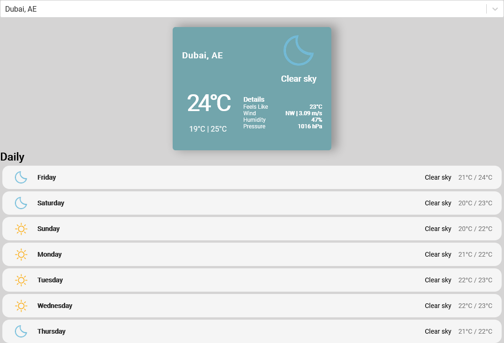
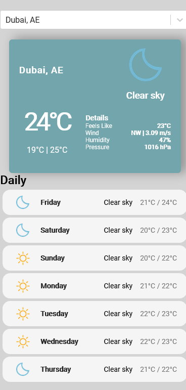

# Wheater APP - Julian Gomez 

This is a website that shows weather and forecasts. made using OpenWheather and geoDBCities APIs.

## Table of contents

- [Overview](#overview)
  - [Screenshot](#screenshot)
  - [Links](#links)
- [My process](#my-process)
  - [Built with](#built-with)
  - [What I learned](#what-i-learned)
  - [Useful resources](#useful-resources)
- [Author](#author)

## Overview

### Screenshot

Desktop View

Mobile View

### Links

- Solution URL: [View source code here](https://github.com/JulianG1808/weather-app)
- Live Site URL: [View live site here](https://weather-app-jgz.vercel.app/)

## My process

### Built with

- HTML5
- React.JS
- SASS
- OpenWeather
- geoDBCities

## Author

- [Portfolio](https://portfolio-julian.vercel.app/)
- [LinkedIn](https://www.linkedin.com/in/leandrojuliangomez/)
- [GitHub](https://github.com/JulianG1808)
